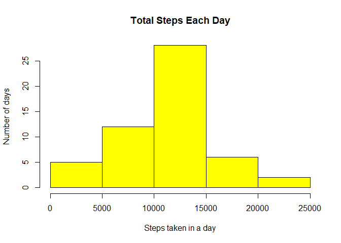
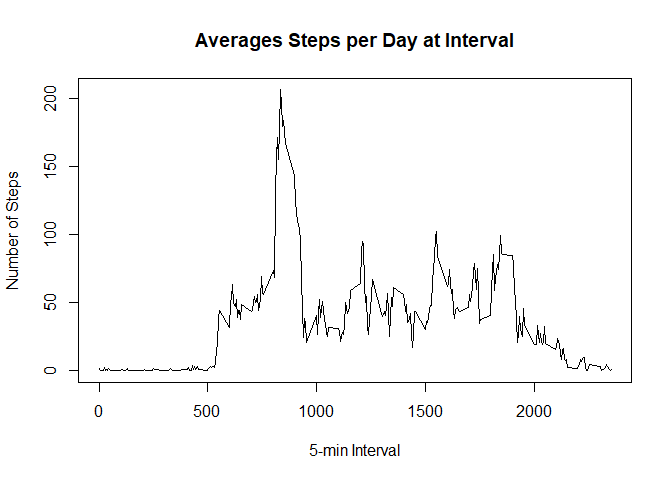
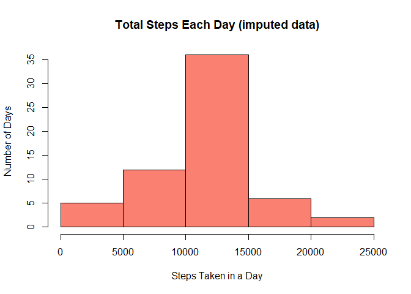
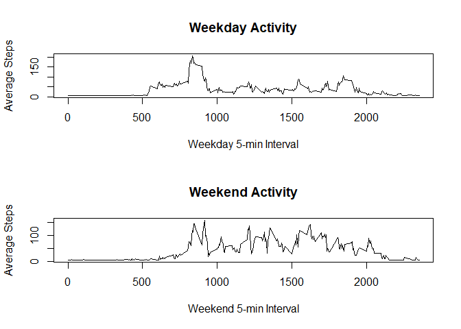

### Load and Preprocess the data

The data is provided in a link on the assignment page. Download the data and save. Open RStudio. Select the location with the csv file as the working directory. Working directory can be chosen by selecting the 'Session' tab, then choosing 'Set Working Directory,' then choosing 'Select Directory' and navigating to the folder where the data is located. Data is named 'pr1' in this example (abbreviation for project 1). Using the 'View' function allows viewing of the data set to aid in analysis.
 

```r
pr1<-read.csv("activity.csv")
View(pr1)
```

### What is mean number of steps taken per day? What is the median number of steps taken per day?

Steps are presented in the data set as total steps taken every 5 minutes. Each interval of 5 minutes is expressed as an interval number, beginning at 0 and ending at 2355. The question requires the number of steps taken per day as a basis for the mean number of steps per day. Take steps data and aggregate by day. Then calculate the mean.


```r
##'pr1' contains steps, date and interval. Some 'steps' records are NA.
##Aggregate 5-min interval data by date by summing all step records for each date.
daysteps <- aggregate(steps ~ date, pr1, sum)

##Build a histogram.
hist(daysteps$steps, main="Total Steps Each Day", col='yellow', xlab="Steps taken in a day", ylab="Number of days")
```

<!-- -->

```r
##Calculate mean and median by date.
pr1mean <- mean(daysteps$steps)
pr1median <- median(daysteps$steps)
```
The mean is 1.0766189\times 10^{4} and the median is 10765.
Of note, there are 53 records for daysteps. That is, 8 days all entries were NA.

### What is the average daily activity pattern?

Build a time series plot of the average number of steps taken in each 5-minute interval (x-axis), averaged across all days (y-axis).


```r
intsteps <- aggregate(steps ~ interval, pr1, mean)
plot(intsteps$interval,intsteps$steps, type="l", xlab="5-min Interval", ylab="Number of Steps",main="Averages Steps per Day at Interval")
```

<!-- -->

```r
maxint <- intsteps[which.max(intsteps$steps),1]
```
The 5 minute interval which contains the maximum number of steps is 835.

## Impute missing values. 
There are a number of days/intervals where there are missing values. The presence of missing days may introduce bias into some calculations or summaries of the data.

Missing values can be imputed by inserting the average number of steps taken overall into the NA spots. This will have a minimal effect on the data set as the mean will not change at all. Although the total number of steps for all 61 days will be higher, that is because the average daily steps for the 8 days that originally had no data has been inserted. Alhtough there is no record of steps taken, it is reasonable to assume that the individual did do an average amount of stepping on the days s/he was not using the activity tracker. 


```r
##Find number of incompete records.
incomplete <- sum(!complete.cases(pr1))

##Impute by taking the average of all intervals, and substituting value in NA.
meanintstep<-mean(pr1$steps, na.rm=TRUE) 
imppr1<-pr1
imppr1$steps[is.na(imppr1$steps)]<-meanintstep

##Re-do the calculations with the imputed data set and see how it effects mean and median.
newdaysteps <- aggregate(steps ~ date, imppr1, sum)
hist(newdaysteps$steps, main="Total Steps Each Day (imputed data)", col='salmon', xlab="Steps Taken in a Day", ylab="Number of Days")
```

<!-- -->

```r
imppr1mean <- mean(newdaysteps$steps)
imppr1median <- median(newdaysteps$steps)
```
The new mean is 1.0766189\times 10^{4} and the new median is 1.0766189\times 10^{4}.


```r
mean_diff <- imppr1mean- pr1mean
median_diff <- imppr1median - pr1median
total_diff <- sum(newdaysteps$steps) - sum(daysteps$steps)
```
The difference in the means is 0, the difference in the medians is 1.1886792, and the difference the the sum of steps over 61 days is `total_diff`. There are now records for all 61 days in the data frame as the average step numbers have been inserted where there were previously NAs. 

The data can be broken into groups, as activity occuring on weekends or weekdays. Then the difference in activity between the types of days can be visually examined. Add the day of the week to the original data frame, pr1. Subset daily data to express activity on weekdays vs weekends. There are two factors to be defined, which can be column binded onto the end of the data set.


```r
y<-weekdays(as.Date(pr1$date))
newimppr1<-cbind(imppr1, y)
x <- factor(y)
levels(x) <- list(weekday=c("Monday", "Tuesday", "Wednesday","Thursday", "Friday"), weekend=c("Saturday", "Sunday"))
newimppr2<-cbind(imppr1, x)
```
Finally, build a two panel plot to compare activity on weekdays and weekends, side by side.


```r
par(mfrow=c(2,1))
weekdaydf<- subset(newimppr2, x=="weekday")
wd <- aggregate(steps ~ interval, weekdaydf, mean, na.rm=TRUE)
plot(wd, type="l", xlab="Weekday 5-min Interval", ylab="Average Steps", main="Weekday Activity")
weekenddf<- subset(newimppr2, x=="weekend")
we <- aggregate(steps ~ interval, weekenddf, mean, na.rm=TRUE)
plot(we, type="l", xlab="Weekend 5-min Interval", ylab="Average Steps", main="Weekend Activity")
```

<!-- -->


